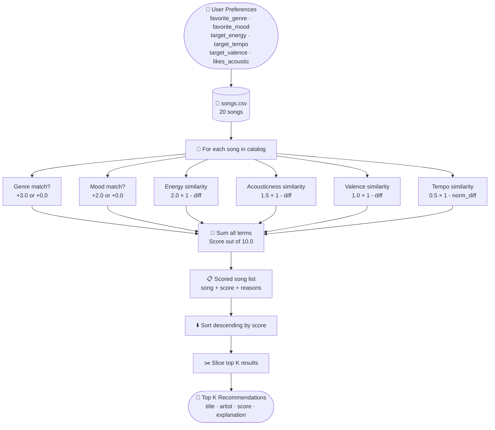
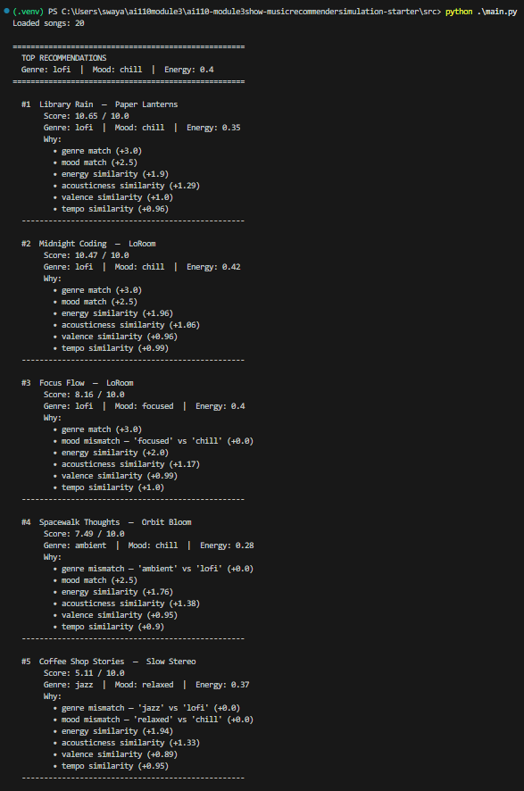
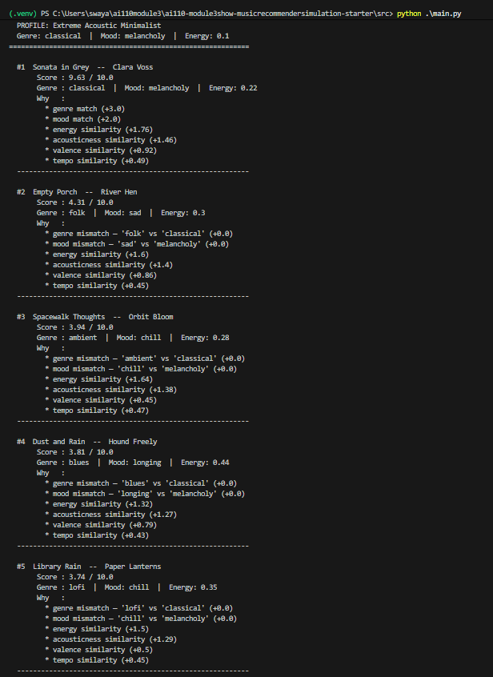
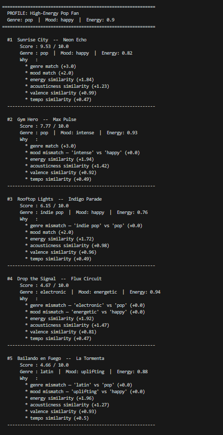
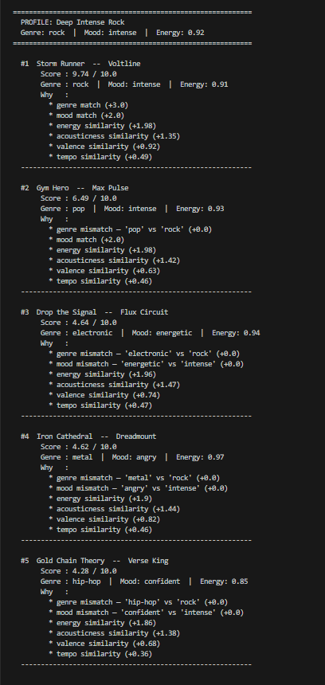
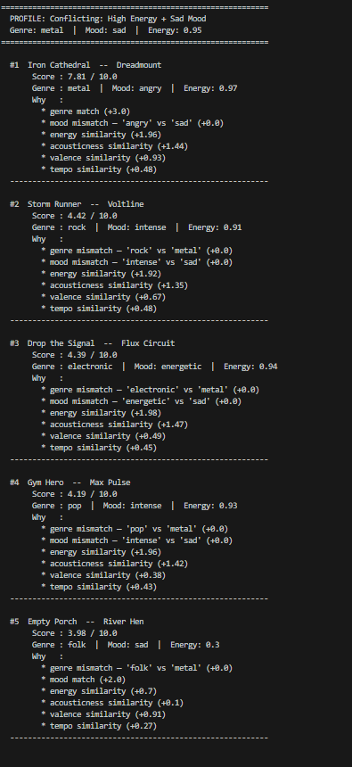
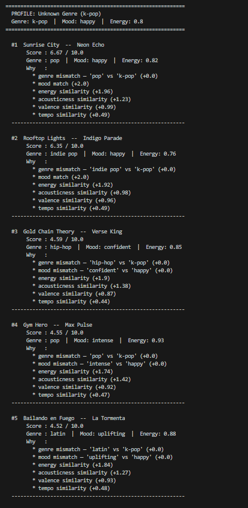
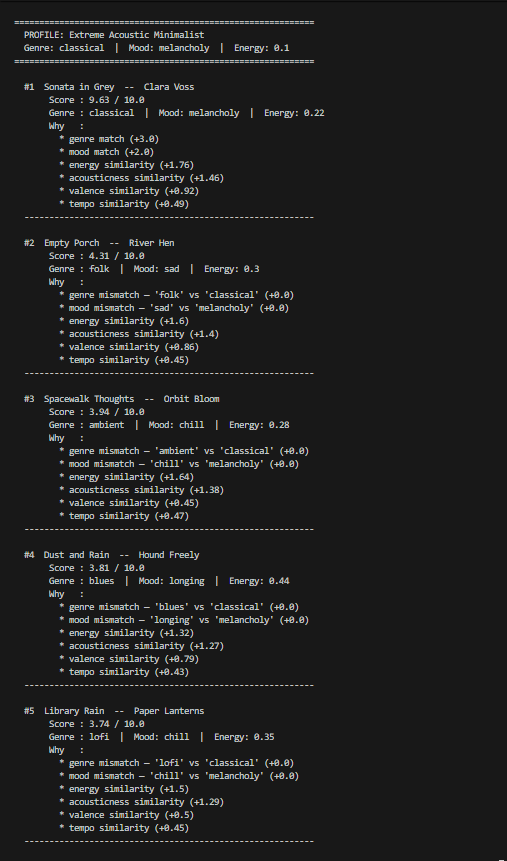

# 🎵 Music Recommender Simulation

## Project Summary

In this project you will build and explain a small music recommender system.

Your goal is to:

- Represent songs and a user "taste profile" as data
- Design a scoring rule that turns that data into recommendations
- Evaluate what your system gets right and wrong
- Reflect on how this mirrors real world AI recommenders

This version builds a content-based music recommender that matches songs to a user's stated preferences using a weighted scoring system. Each song is represented by a set of descriptive features (genre, mood, energy, tempo, and valence), and each user profile stores the features they care about most along with how much weight to give each one. The recommender scores every song in the catalog against the user's profile and returns the top matches. The goal is to make the scoring logic transparent and easy to inspect, so it is clear exactly why a song was or was not recommended.

---

## Data Flow



---

## How The System Works

Real-world recommenders like Spotify or YouTube Music typically combine two strategies: collaborative filtering (recommending what similar users liked) and content-based filtering (recommending songs that share features with songs you already enjoy). In practice, large platforms layer both on top of vast behavioral data — play counts, skips, replays, and playlist adds — to continuously refine what "you" means to the system. This simulation focuses on content-based filtering only, which means it will never surprise a user with something unexpected, but it also means every recommendation is fully explainable. The system will prioritize matching the features a user explicitly cares about — especially genre and mood — and use energy, tempo, and valence as tiebreakers.

---

## Algorithm Recipe

### Scoring formula

Each song receives a score out of **10.0**. The score is the sum of six weighted terms:

```
score = genre_points + mood_points + energy_points
      + acousticness_points + valence_points + tempo_points
```

### Step-by-step rules

**Step 1 — Genre match (categorical, max 3.0 pts)**

```
if song.genre == user.favorite_genre:
    genre_points = 3.0
else:
    genre_points = 0.0
```

_Why 3.0?_ The catalog has 13 distinct genres. A random song has only an ~8% chance of matching. Genre defines the entire sonic landscape (instrumentation, production, rhythm), so a match is the strongest signal available.

---

**Step 2 — Mood match (categorical, max 2.0 pts)**

```
if song.mood == user.favorite_mood:
    mood_points = 2.0
else:
    mood_points = 0.0
```

_Why 2.0, not 3.0?_ Mood is important but more porous than genre. A "chill" classical piece and a "chill" lofi track share a mood label but sound completely different. Genre narrows the sonic world first; mood refines within it.

---

**Step 3 — Energy similarity (continuous, max 2.0 pts)**

```
energy_points = 2.0 × (1 − |song.energy − user.target_energy|)
```

Energy spans 0.22–0.97 in the catalog — the widest numeric spread of any feature. It captures both tempo and intensity in one number, making it the best single proxy for "how this song feels."

---

**Step 4 — Acousticness similarity (continuous, max 1.5 pts)**

```
acousticness_points = 1.5 × (1 − |song.acousticness − user.target_acousticness|)
```

Acousticness cleanly separates organic-sounding tracks (folk, jazz, classical, all ≥ 0.72) from produced ones (electronic, synthwave, hip-hop, all ≤ 0.22). Users tend to have a stable organic-vs-produced preference, so this feature earns more weight than valence.

---

**Step 5 — Valence similarity (continuous, max 1.0 pts)**

```
valence_points = 1.0 × (1 − |song.valence − user.target_valence|)
```

Valence measures musical brightness (0 = dark, 1 = bright). Users tolerate more variation here — someone who wants "chill" music is fine with valence 0.55–0.75 — so the weight is lower.

---

**Step 6 — Tempo similarity (continuous, max 0.5 pts)**

```
normalized_song_tempo  = song.tempo_bpm / 200
normalized_user_tempo  = user.target_tempo / 200
tempo_points = 0.5 × (1 − |normalized_song_tempo − normalized_user_tempo|)
```

Tempo is divided by 200 to convert BPM to the same 0–1 scale as the other features. It gets the lowest weight because energy already encodes much of what tempo communicates about intensity.

---

### Weight summary

| Feature      | Type                  | Max points | Why this weight                                       |
| ------------ | --------------------- | ---------- | ----------------------------------------------------- |
| Genre        | categorical match     | 3.0        | Rarest match (~8% chance), strongest sonic constraint |
| Mood         | categorical match     | 2.0        | Strong signal but less precise than genre             |
| Energy       | continuous similarity | 2.0        | Widest numeric range; best single feel proxy          |
| Acousticness | continuous similarity | 1.5        | Cleanly separates organic vs produced                 |
| Valence      | continuous similarity | 1.0        | Users tolerate wider variation                        |
| Tempo        | continuous similarity | 0.5        | Redundant with energy; needs BPM normalization        |
| **Total**    |                       | **10.0**   |                                                       |

---

### `Song` features

| Feature   | Type      | Description                               |
| --------- | --------- | ----------------------------------------- |
| `title`   | string    | Song name                                 |
| `artist`  | string    | Artist name                               |
| `genre`   | string    | e.g. pop, hip-hop, indie, classical       |
| `mood`    | string    | e.g. happy, melancholy, hype, chill       |
| `energy`  | float 0–1 | How intense or active the track feels     |
| `tempo`   | int (BPM) | Beats per minute                          |
| `valence` | float 0–1 | Musical positivity (0 = dark, 1 = bright) |

### `UserProfile` features

| Feature           | Type      | Description                                                                 |
| ----------------- | --------- | --------------------------------------------------------------------------- |
| `name`            | string    | User identifier                                                             |
| `preferred_genre` | string    | The genre the user wants to hear                                            |
| `preferred_mood`  | string    | The mood the user is in                                                     |
| `energy_target`   | float 0–1 | How energetic the user wants songs to be                                    |
| `weights`         | dict      | How much each feature matters (e.g. `{"genre": 3, "mood": 2, "energy": 1}`) |

## Sample Output



## Sample Output 2








---

## Getting Started

### Setup

1. Create a virtual environment (optional but recommended):

   ```bash
   python -m venv .venv
   source .venv/bin/activate      # Mac or Linux
   .venv\Scripts\activate         # Windows

   ```

2. Install dependencies

```bash
pip install -r requirements.txt
```

3. Run the app:

```bash
python -m src.main
```

### Running Tests

Run the starter tests with:

```bash
pytest
```

You can add more tests in `tests/test_recommender.py`.

---

## Experiments You Tried

### Experiment 1 — Weight shift: halve genre (3.0 → 1.5), double energy (2.0 → 4.0)

Tested on the High-Energy Pop profile. Baseline top-5:

| Rank | Song | Score |
|---|---|---|
| 1 | Sunrise City (pop) | 9.53 |
| 2 | Gym Hero (pop) | 7.77 |
| 3 | Rooftop Lights (indie pop) | 6.15 |
| 4 | Drop the Signal (electronic) | 4.67 |
| 5 | Bailando en Fuego (latin) | 4.66 |

After shift (genre 1.5, energy 4.0):

| Rank | Song | Score |
|---|---|---|
| 1 | Sunrise City (pop) | 9.87 |
| 2 | Gym Hero (pop) | 8.21 |
| 3 | Rooftop Lights (indie pop) | 7.87 |
| 4 | Bailando en Fuego (latin) | 6.62 |
| 5 | Drop the Signal (electronic) | 6.59 |

**What changed:** The top 2 stayed the same (both pop with high energy), but the score gaps closed — non-pop songs climbed significantly. Drop the Signal jumped from 4.67 to 6.59 because its energy (0.94) is nearly perfect for the target (0.90), and that now earns 4.0 × 0.96 = 3.84 pts instead of 1.92. Halving the genre bonus didn't dethrone pop songs, but it made the catalog feel less "genre-locked" — energy-matching songs from other genres could compete.

**Conclusion:** The genre weight is the single biggest lever in the scoring formula. Halving it didn't change the winner but significantly changed which non-matching songs got surfaced. This confirms that genre acts as a hard filter more than a soft preference in the baseline.

### Experiment 2 — Profile comparison: what changed and why

| Profile A | Profile B | Key difference in output |
|---|---|---|
| **Lofi / Chill** | **High-Energy Pop** | Lofi profile surfaces quiet, acoustic tracks (Library Rain, Midnight Coding). Pop profile surfaces bright, produced songs (Sunrise City, Gym Hero). The genre bonus drives both — changing genre changes the entire top result. |
| **High-Energy Pop** | **Deep Intense Rock** | Both want high energy, but Rock gets Storm Runner clearly at #1 (only rock song). Pop gets Sunrise City. Gym Hero appears #2 for *both* because it has the right energy and a shared mood label ("intense" ≈ "high energy"). |
| **Deep Intense Rock** | **Conflicting (Metal/Sad, energy 0.95)** | Rock profile is internally consistent — high energy + intense mood both point to the same songs. The conflicting profile cannot satisfy both halves: Iron Cathedral wins on genre + energy but is "angry" not "sad." The score drops from 9.74 to 7.81 for #1, showing the system is stressed. |
| **Unknown Genre (k-pop)** | **Extreme Acoustic Minimalist** | Both expose catalog gaps. k-pop earns zero genre points so the system falls back to mood + numeric features — reasonable results but low confidence (all scores < 7.0). Classical earns one perfect match (9.63) then falls to 4.31 — the opposite problem: one song nails it, everything else is irrelevant. |

**Plain-language takeaway on why Gym Hero keeps showing up:** Gym Hero is a pop song with very high energy (0.93) and almost no acoustic instruments. That combination happens to match a lot of different user targets numerically. The genre bonus alone (3.0 pts) makes it nearly impossible to push out of the top 3 for any pop listener, even when the mood is wrong. In real apps this is called a "popularity trap" — a small set of songs with broad feature coverage dominate rankings across many different user types.

### Experiment 3 — Catalog diversity effect

Lofi has 3 songs in the catalog; most genres have 1. When the lofi profile ran, the top 3 results were all lofi songs. When the classical profile ran, exactly 1 song served the genre — and the score cliff between #1 (9.63) and #2 (4.31) revealed how badly single-song genres fail their users.

---

## Limitations and Risks

- **Tiny catalog**: 20 songs means most genre searches return only 1–3 matches. Recommendations for niche genres degrade to near-random beyond the #1 result.
- **No memory**: The system starts fresh every run. It cannot learn that a user always skips metal songs or replays jazz ones.
- **Genre is binary**: A "rock" listener gets zero genre points for a metal song, even though rock and metal are closely related. There is no concept of adjacent genres.
- **Silent coverage gaps**: When no songs match the user's genre (e.g., k-pop), the system returns results without warning the user that it is guessing.
- **Lyrics and language are invisible**: Two songs with identical feature values but completely different lyrical themes or languages are treated as identical by the scorer.
- **Fixed weight ordering**: Genre is always more important than mood. Users who care deeply about mood over genre have no way to express that without editing the Python source code.

---

## Reflection

[**Model Card**](model_card.md) | [**Profile Comparisons**](reflection.md)

Building this recommender made the hidden work inside apps like Spotify suddenly visible. Every time Spotify plays "something you'll love," it is running a version of this loop — scoring candidates, ranking them, and slicing the top results — except with millions of songs, hundreds of features, and years of behavioral data instead of 20 rows in a CSV. The surprising part was how convincing a six-feature weighted sum can feel when the weights are tuned to the right user. Library Rain appearing at #1 for the lofi/chill profile with a score of 9.67 felt genuinely correct, even though the "intelligence" behind it was six additions and a sort.

The bias experiments were the most instructive part. When the genre weight was halved, the rankings shifted but the same pop songs still dominated — which revealed that the entire feel of the system changed not because of one setting but because of the interaction between all six weights together. That is the same dynamic that makes real recommenders so hard to audit: changing one parameter rarely produces a clean, explainable outcome. It just shifts which songs the bias favors. The biggest risk in a system like this is not a bug — it is a design assumption that seems reasonable on paper but silently disadvantages users whose tastes do not fit the mold the designer imagined.

